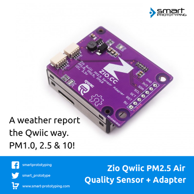

# Zio Qwiic PM2.5 Air Quality Sensor Adapter Board

> This product can be available for purchase [here](https://www.smart-prototyping.com/Zio-Qwiic-PM-Air-Quality-Sensor-and-Adapter-Board).

#### Description

This is a PM sensor + Qwiic adapter board product, you will get the PM sensor and an easy to use adapter board.

The PM sensor is a compact (compare to the other PM sensors) and accurate sensor. It can directly output the PM 1.0, 2.5, 10.0 rate of the air in unit of the µg/m3 (PM standard unit), just like the weather report.

This is an I2C version of the sensor, which also has UART interface version.  The adapter board can be directly attached to the sensor with the female header, and we offer you two ways to setup the connection, the easiest way is to use Qwiic cable to connect to Qwiic connector, with no soldering; another way is soldering the breakout pins. 

The adapter board can be fixed very well by the 2.0mm screws with the two 2.0mm holes on the board. And there are two 3mm mounting holes for you to fix this module to any other place you want.

Note 1: the fan on the sensor needs 5v to drive it. We have added a voltage step-up circuit to convert the I2C 3.3V (Qwiic connector) to 5V for the fan. So please be sure to use 5V power when you are using these breakout pins.

Note 2: The sensor needs to take around 30s to warm up to get the accurate data.

#### Specification

* IC: PMSA003I
* I2C address: 0x12
* Operation Current: less than 100mA
* Operation Temperature: -10 to 60 degrees Celsius.
* Adapter board dimension: 44.3 x 35.0mm
* PM sensor Dimension: 12.2 x 35.3 x 38.3 mm
* Total Weight: 24.8g

#### Links

* [PCB Source file](https://github.com/ZIOCC/Zio-Qwiic-PM2.5-Air-Quality-Sensor-Adapter-Board/tree/master/EAGLE)
* [PCB schematic](https://github.com/ZIOCC/Zio-Qwiic-PM2.5-Air-Quality-Sensor-Adapter-Board/blob/master/zio%20qwiic%20pm%20sensor%20adapter%20board.pdf)
* [Demo code](https://github.com/ZIOCC/Zio-Qwiic-PM2.5-Air-Quality-Sensor-Adapter-Board/tree/master/PMSA003I)
* [PM sensor PMSA003I Datasheet](https://github.com/ZIOCC/Zio-Qwiic-PM2.5-Air-Quality-Sensor-Adapter-Board/blob/master/PMSA003%20series%20data%20manua_English_V2.6.pdf) (Not very good English in the datasheet, [contact us](mailto:info@smart-prototyping.com) if you have any question)

###### About Zio
> Zio is a new line of open sourced, compact, and grid layout boards, fully integrated for Arduino and Qwiic ecosystem. Designed ideally for wearables, robotics, small-space limitations or other on the go projects. Check out other awesome Zio products [here](https://www.smart-prototyping.com/Zio).
